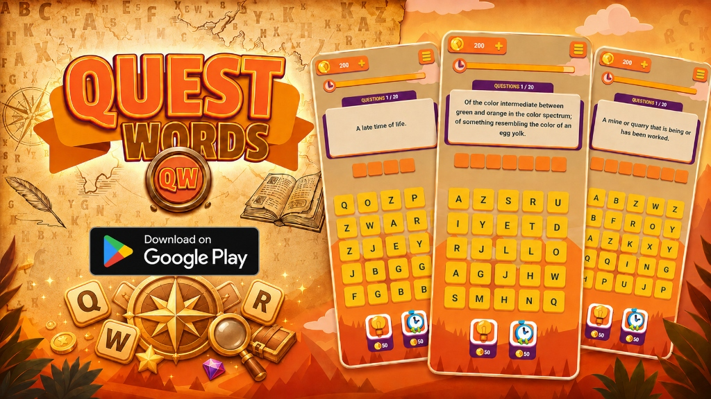
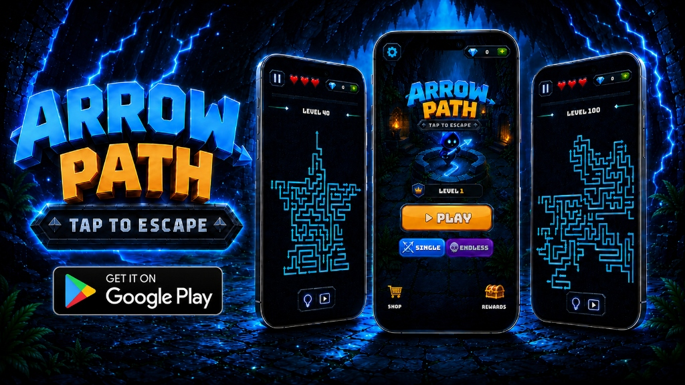

  <!-- LANGUAGE TOGGLE BUTTON -->
  

    

  <!-- DYNAMIC TYPING SVG HEADER -->
  

   

  <!-- PROFILE VIEWS COUNTER & SOCIAL BADGES -->
  

    
    
    
    
    
    
  

---

### 📊 GitHub Profile Overview

  

---

### 👨‍💻 About Me

- 🎓 **Education:** Computer Engineering Student & **Backend & Mobile Game Developer**.
- 👑 **Flagship Project:** **[ECommerce-Microservices-Platform](https://github.com/yucelaybey/ECommerce-Microservices-Platform)** — Enterprise .NET 8.0 Clean Architecture (DDD), Microservices, API Gateway, RabbitMQ, Elasticsearch, Redis & Vue.js 3.
- 🤖 **Autonomous AI System:** **[X AI Auto Poster](https://github.com/yucelaybey/x-ai-autoposter)** — Fully autonomous tech news publisher running 7/24 on Cloudflare Workers, Workers AI & X API v2.
- 📱 **Published Mobile Games:** **Quest Words** and **Arrow Path** live on the Google Play Store.
- 💡 **Core Expertise:** Microservices Architecture, Clean Architecture & DDD, CQRS (MediatR), Event-Driven Systems (RabbitMQ), Mobile Game Development, Backend (.NET 8.0, Node.js, Python).
- 💬 **Get In Touch:** Open for collaborations on Backend Microservices, System Architecture & Game Development.
- ☕ **Motto:** *Clean Architecture, High Performance, Elegant Code.*

---

### 📱 Published Mobile Games & Apps

#### 🔤 1. Quest Words — Brain Puzzle

  
<b>🧠 An immersive word puzzle game designed to challenge your mind and expand your vocabulary!</b> 
  Connect letter blocks based on hints, conquer tricky levels, and test your brainpower in the ultimate word hunt!

  

    

  

---

#### 🏹 2. Arrow Path — Tap To Escape

  
<b>⚡ The ultimate maze escape challenge! Analyze arrow paths, dodge obstacles, and race against time!</b> 
  Study arrow directions carefully, time your taps perfectly, and navigate your way out of complex labyrinth paths!

  

    

  

---

### 🛠️ Tech Stack & Skills

  <b>Languages & Backend:</b> 
  

  <b>Web & Frontend:</b> 
  

  <b>Databases, Cloud & DevOps Tools:</b> 
  

---

### 🔥 Featured Projects & Repositories

| Project Name | Description | Tech Stack | Repository Link |
| :--- | :--- | :--- | :---: |
| 👑 **ECommerce Microservices Platform** | Enterprise Microservices system built with Clean Architecture (DDD), CQRS, MediatR, API Gateway, RabbitMQ, Elasticsearch, Redis & Vue 3. | `C#` `.NET 8.0` `Microservices` `RabbitMQ` `Elasticsearch` `Vue 3` | [View Repo 🔗](https://github.com/yucelaybey/ECommerce-Microservices-Platform) |
| 🤖 **X AI Auto Poster** | Autonomous tech news bot running 7/24 on Cloudflare Workers & Workers AI, publishing news to X (Twitter). | `Node.js` `TypeScript` `Workers AI` `Cloudflare D1` `X API v2` | [View Repo 🔗](https://github.com/yucelaybey/x-ai-autoposter) |
| 🛍️ **MultiVendor Shopping Platform** | Multi-vendor e-commerce platform with API Gateway routing, isolated DTO layer & WebUI interface. | `C#` `.NET Core` `API Gateway` `WebUI` `DTO` | [View Repo 🔗](https://github.com/yucelaybey/MultiVendor-Shopping-Platform) |
| 🎬 **Vue Movie Search App** | Reactive Vue 3 & Vite web application featuring top 100 movies listing, real-time movie search & detail view. | `Vue 3` `Vite` `JavaScript` `REST API` | [View Repo 🔗](https://github.com/yucelaybey/Vue-Movie-Search-App) |
| 🛒 **ASP.NET Core E-Commerce App** | Full-fledged e-commerce platform built with ASP.NET Core 8.0, Identity Core & MSSQL. | `C#` `.NET 8.0` `MSSQL` `Bootstrap` | [View Repo 🔗](https://github.com/yucelaybey/AspNetCore-ECommerce-App) |
| 🚗 **CarBook Rental Platform** | Car rental web platform engineered with CQRS & Mediator Design Patterns. | `C#` `.NET 8.0` `Mediator` `Entity Framework` | [View Repo 🔗](https://github.com/yucelaybey/CarBook-Rental-Platform) |
| 🏨 **Hotel Reservation System** | Hotel booking & reservation management platform featuring REST API & Admin Dashboard. | `JavaScript` `HTML/CSS` `REST API` | [View Repo 🔗](https://github.com/yucelaybey/Hotel-Reservation-System) |
| 💻 **Portfolio Management System** | Dynamic portfolio web application powered by ASP.NET Core 8.0 & Identity Core. | `C#` `.NET 8.0` `Identity Core` `SCSS` | [View Repo 🔗](https://github.com/yucelaybey/Portfolio-Management-System) |
| 🏥 **Hospital Management System (MHRS)** | Hospital Information Management System with Admin & Patient panels. | `C#` `.NET` `MSSQL` | [View Repo 🔗](https://github.com/yucelaybey/Hospital-Management-System) |
| 📚 **Library Automation System** | Library book tracking and management automation system. | `Vue.js` `JavaScript` `HTML/CSS` | [View Repo 🔗](https://github.com/yucelaybey/Library-Automation-System) |

---

### 📊 GitHub Statistics

  
  &nbsp;
  

  

---

### 📈 GitHub Activity Graph

  

---

### 🐍 Contribution Grid Snake Animation

  

---

### 💬 Developer Quote of the Day

  

---

  <i>⚡ Yücel AYBEY (@yucelaybey) • GitHub Profile Page</i>

